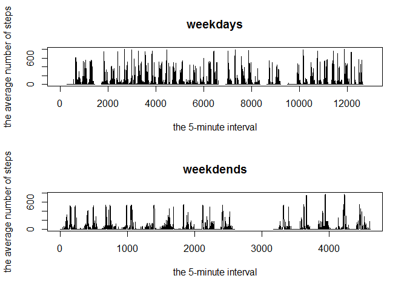

```r
library(dplyr)
```

```
## 
## Attaching package: 'dplyr'
```

```
## The following objects are masked from 'package:stats':
## 
##     filter, lag
```

```
## The following objects are masked from 'package:base':
## 
##     intersect, setdiff, setequal, union
```

```r
library(ggplot2)
library(lubridate)
```

```
## 
## Attaching package: 'lubridate'
```

```
## The following object is masked from 'package:base':
## 
##     date
```

## Loading and preprocessing the data


```r
activity= read.csv("activity.csv")


activity$date= as.Date(activity$date)

#extract day from date then collapse steps sum function grouping by day
activity1= dplyr::mutate(activity,day=day(activity$date))

activity1=group_by(activity1,day)%>% summarise(steps=sum(steps,na.rm = T))
```


## What is mean total number of steps taken per day?


```r
ggplot(data = activity1,aes(day,steps)) + geom_histogram(stat = "identity") + labs(title= " total number of steps taken each day",ylab="Steps",xlab="Day") + theme_bw()
```

```
## Warning: Ignoring unknown parameters: binwidth, bins, pad
```

<!-- -->

## What is the average daily activity pattern?

```r
#we have already grouped our data by day so we proceed to apply mean and median fun on summarise

group_by(activity1,day)%>%summarise(mean_steps=mean(steps,na.rm = T),median_steps = median(steps,na.rm = T))
```

```
## # A tibble: 31 x 3
##      day mean_steps median_steps
##    <int>      <dbl>        <int>
##  1     1          0            0
##  2     2      10726        10726
##  3     3      21923        21923
##  4     4      12116        12116
##  5     5      23733        23733
##  6     6      23754        23754
##  7     7      23898        23898
##  8     8       3219         3219
##  9     9      12811        12811
## 10    10       9900         9900
## # ... with 21 more rows
```
##Time series plot of the average number of steps taken

```r
#group by interval then collapse 

activity2=group_by(activity,interval)%>% summarise(steps=sum(steps,na.rm = T))

ggplot(activity2,aes(x=interval,y=steps))+ geom_line() + labs(title="Time series plot of the average number of steps taken",xlab="5 - minutes interval per day",ylab= "Steps") + theme_bw()
```

<!-- -->

##The 5-minute interval that, on average, contains the maximum number of steps

```r
summary(activity$steps,na.rm=T)
```

```
##    Min. 1st Qu.  Median    Mean 3rd Qu.    Max.    NA's 
##    0.00    0.00    0.00   37.38   12.00  806.00    2304
```

```r
filter(activity,steps==806)
```

```
##   steps       date interval
## 1   806 2012-11-27      615
```

```r
#the interval with with maximum steps is 615
```


## Imputing missing values


```r
#we replace all missing values with mean

activity4= activity

activity4$steps[is.na(activity4$steps)]= as.integer(mean(activity4$steps,na.rm=T))
```

##Histogram of the total number of steps taken each day after missing values are imputed

```r
activity4$date= as.Date(activity4$date)

#extract day from date then collapse steps sum function grouping by day
activity4= dplyr::mutate(activity4,day=day(activity4$date))

activity4=group_by(activity4,day)%>% summarise(steps=sum(steps,na.rm = T))

ggplot(data = activity4,aes(day,steps)) + geom_histogram(stat = "identity") + labs(title= " total number of steps taken each day",ylab="Steps",xlab="Day") + theme_bw()
```

```
## Warning: Ignoring unknown parameters: binwidth, bins, pad
```

<!-- -->

## Are there differences in activity patterns between weekdays and weekends?

```r
activity5=mutate(activity,weekdays=weekdays(activity$date))

##create two rows and one column panel in plot
par(mfrow = c(2,1))
##weekday dataset
activity5wd= filter(activity5,weekdays %in% c("Friday","Monday","Thursday","Tuesday","Wednesday"))

activity5wdend= filter(activity5,weekdays %in% c("Saturday","Sunday"))

plot(activity5wd$steps, type = "l", main = "weekdays"
     ,xlab = "the 5-minute interval"
     ,ylab = "the average number of steps")

plot(activity5wdend$steps, type = "l", main = "weekdends"
     ,xlab = "the 5-minute interval"
     ,ylab = "the average number of steps")
```

<!-- -->

